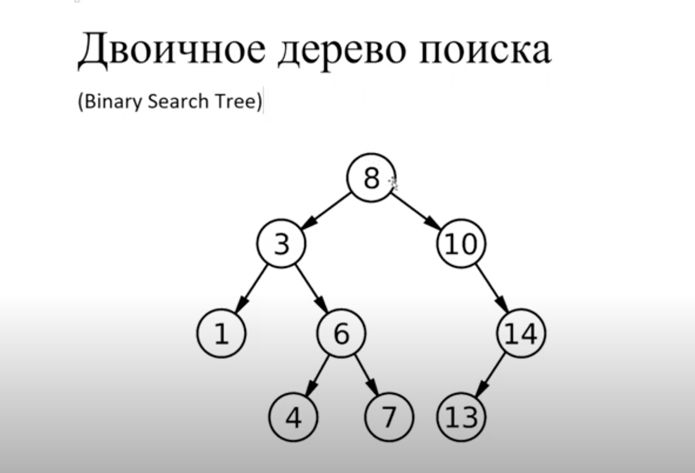

# Binary Search Tree by Nikolay Grigoryev
>> Двоичное дерево поиска
   (Binary Search Tree)

   
>Прямой обход (NLR) 
   
   	•	Проверяем, не является ли текущий узел пустым или null.
   	•	Показываем поле данных корня (или текущего узла).
   	•	Обходим левое поддерево, рекурсивно вызвав функцию прямого обхода.
   	•	Обходим правое поддерево, рекурсивно вызвав функцию прямого обхода.
   
   NLR wiki: 
   https://en.wikipedia.org/wiki/Tree_traversal#Pre-order_(NLR)

Бинарное дерево это фрактал и поэтому для фрактальной структуры используется рекурсия

## Прямой обход (NLR)

1. Проверяем, не является ли текущий узел пустым или null.
2. Показываем поле данных корня (или текущего узла).
3. Обходим левое поддерево рекурсивно, вызвав функцию прямого обхода.
4. Обходим правое поддерево рекурсивно, вызвав функцию прямого обхода.
> wiki: https://en.wikipedia.org/wiki/Tree_traversal

!!! Печатает все элементы в порядке возрастания 

Nikolay Grigoryev youtube channel:
https://www.youtube.com/channel/UCuj3cYM-dqbHNwL9LfM3p1g
